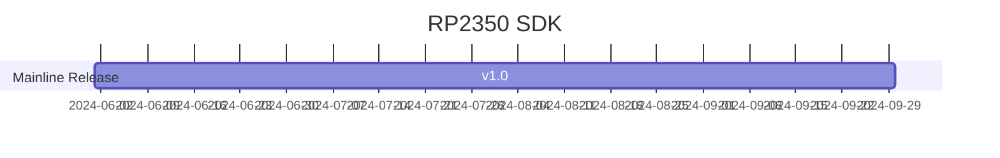

# [RP2350](https://github.com/SoCXin/RP2350)

* [Raspberry Pi](https://www.raspberrypi.com/)：[Cortex-M33](https://github.com/SoCXin/Cortex)
* [L2R2](https://github.com/SoCXin/Level)：2x 150 MHz

## [简介](https://github.com/SoCXin/RP2350/wiki)

[RP2350](https://www.raspberrypi.com/products/rp2350)

### 关键特性

* 2x 150 MHz Cortex-M33/Hazard3
* 520KB SRAM + 16MB QSPI Flash + 8KB OTP
◦ 2× UARTs
* 2× SPI controllers
* 2× I2C controllers
* 24× PWM channels
* USB 1.1 controller and PHY, with host and device support
* 12× PIO state machines
* 1× HSTX peripheral
* 封装：QFN-80 (10×10 mm) and QFN-60 (7×7 mm) 

## [资源收录](https://github.com/SoCXin)

* [参考资源](src/)
* [参考文档](docs/)
* [参考工程](project/)

## [选型建议](https://github.com/SoCXin)

[RP2350](https://datasheets.raspberrypi.com/rp2350/rp2350-datasheet.pdf) 
